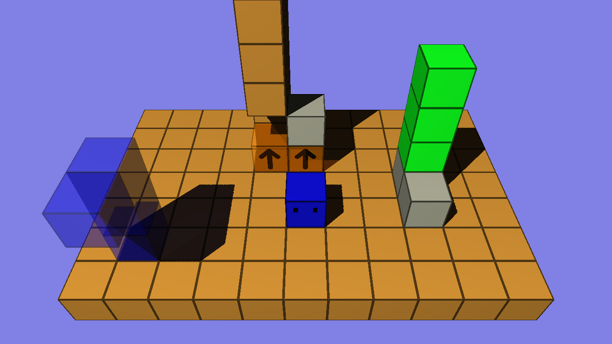

# 3D-Block-Pusher

A 3D block-pushing-game made in C++ using my custom engine. The engine is built on Win32, Xlib, and Opengl, and can be found in [lib/engine](./lib/engine/) and [include/engine](./include/engine)

The game can be compiled and played through the files [run.sh](./run.sh) on Linux and [run.bat](./run.bat) on Windows. To compile on Windows you need to use the [tdm-gcc](https://jmeubank.github.io/tdm-gcc/) compiler.

